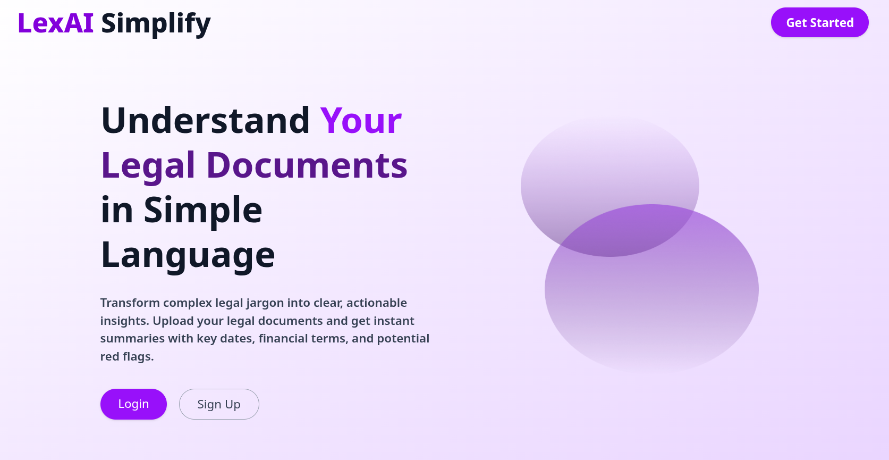

# LexAI Simplify – Turning Legal Jargon into Everyday Language

LexAI Simplify is an **AI-powered platform** that makes legal documents easier to understand, explore, and act upon.
Instead of providing only summaries, it delivers **clause-level explanations, risk detection, role-based insights, and interactive Q\&A** for contracts, agreements, and policies.



---

## Project Structure

```
LexAI/
│
├── frontend/   → React + Vite + TypeScript user interface
├── backend/    → FastAPI + Python microservices
└── README.md   → Main project overview
```

* [Frontend README](./frontend/readme.md)
* [Backend README](./backend/readme.md)

---

## Problem

* Legal documents are **complex, lengthy, and full of jargon**.
* Professionals spend hours reviewing clauses; non-experts risk **misinterpretation**.
* This leads to **delays, errors, and high costs** in decision-making.

---

## Solution

* Upload contracts, agreements, and policies (PDF/DOCX/TXT).
* Automatically extract **clauses, obligations, rights, and risks**.
* Receive **plain-language explanations** tailored to different roles (e.g., tenant vs. landlord).
* Ask questions directly with **interactive contract Q\&A**.
* Export structured insights as a **report or PDF**.

---

## Future Scope

* Multi-language legal support
* Industry-specific modules (real estate, corporate, healthcare)
* Integration with legal research databases
* Automated compliance and red-flag reporting
